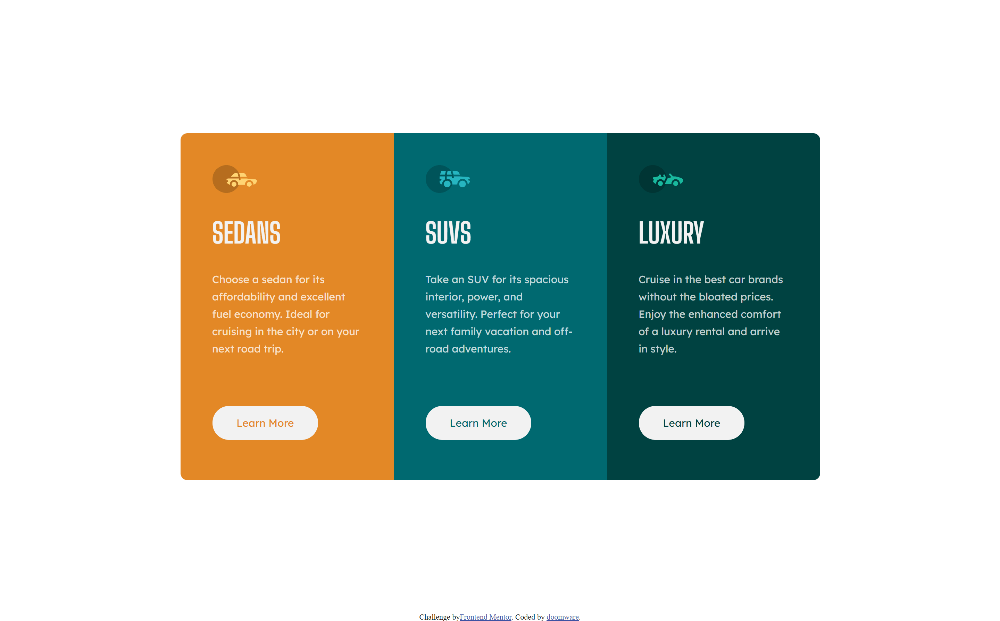
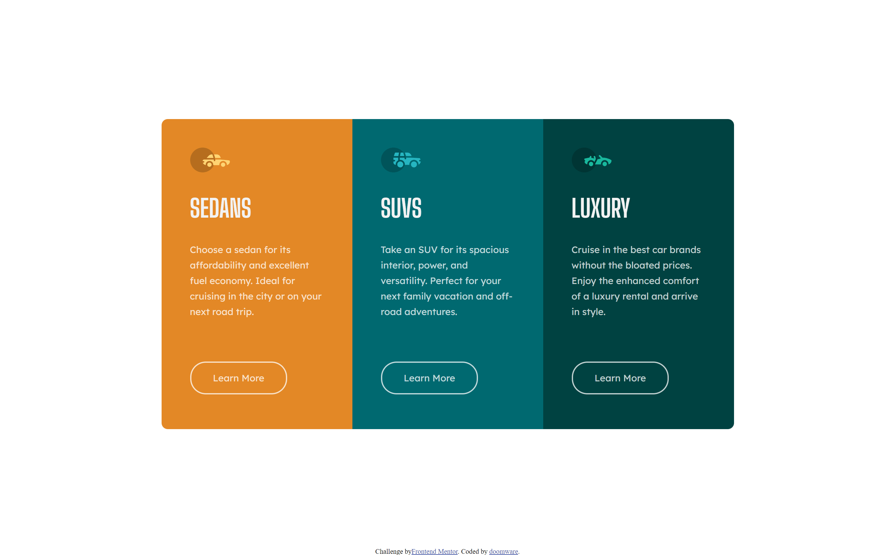

# Frontend Mentor - 3-column preview card component solution

This is a solution to the [3-column preview card component challenge on Frontend Mentor](https://www.frontendmentor.io/challenges/3column-preview-card-component-pH92eAR2-). Frontend Mentor challenges help you improve your coding skills by building realistic projects. 

## Table of contents

- [Overview](#overview)
  - [The challenge](#the-challenge)
  - [Screenshot](#screenshot)
  - [Links](#links)
  - [Built with](#built-with)

- [Author](#author)
- [Acknowledgments](#acknowledgments)

## Overview

### The challenge

Users should be able to:

- View the optimal layout depending on their device's screen size
- See hover states for interactive elements

### Screenshot
##### Desktop design

##### Desktop active design

##### Mobile design

### Links

- Solution URL: [https://github.com/doomware/3-column-preview-card](https://github.com/doomware/3-column-preview-card)
- Live Site URL: [https://doomware.github.io/3-column-preview-card](https://doomware.github.io/3-column-preview-card)

### Built with

- CSS custom properties
- Flexbox
- Mobile-first workflow
- [React](https://reactjs.org/) - JS library

## Author

- Frontend Mentor - [@doomware](https://www.frontendmentor.io/profile/doomware)
- Twitter - [@d00mwar3](https://twitter.com/d00mwar3)
